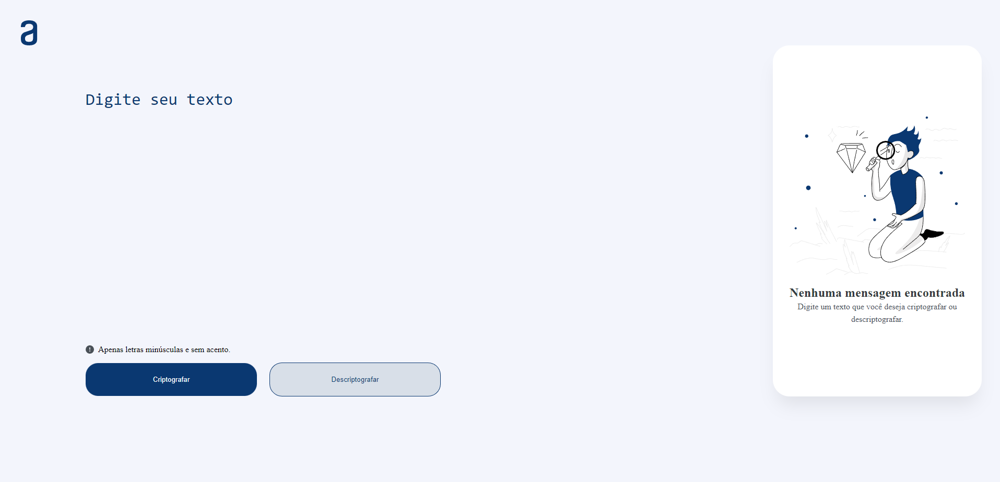
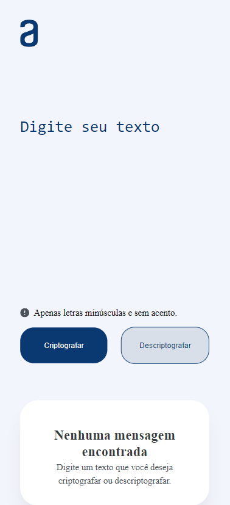

<h1 align="center">Decodificador de texto One</h1>

## 🔖Preview

<p>
  
	
	</p>
  
## 📜 Sobre
<p>
Desafio do projeto Oracle one 5º edição.
</p>
<p>
	O desafio consiste em criar uma aplicação onde é possível criptografar e descriptogrfar um texto apenas com javascript puro. As regras de criptografia são dadas no desafio.
</p>

## 🚀 Tecnologias

- Html
- Css
- Javascript

## 💻 Iniciando o Projeto

### Requisitos

**Clone o Projeto e acesse o Diretório**
<font size="3">(OBS: Necessário ter o git instalado)<font />

```bash
$ git clone https://github.com/andreydantasvf/DecodificadorTextoAlura && cd DecodificadorTextoAlura
```

**Para iniciar a aplicação:**
Abra o arquivo index.html em seu navegador

---

Feito por Andrey Dantas 👋 Siga minhas redes sociais:

- [Instagram](https://www.instagram.com/andreydantasvf/)
- [Twitter](https://twitter.com/andreydantasvf)
- [Linkedin](https://www.linkedin.com/in/andreydantasvf/)
